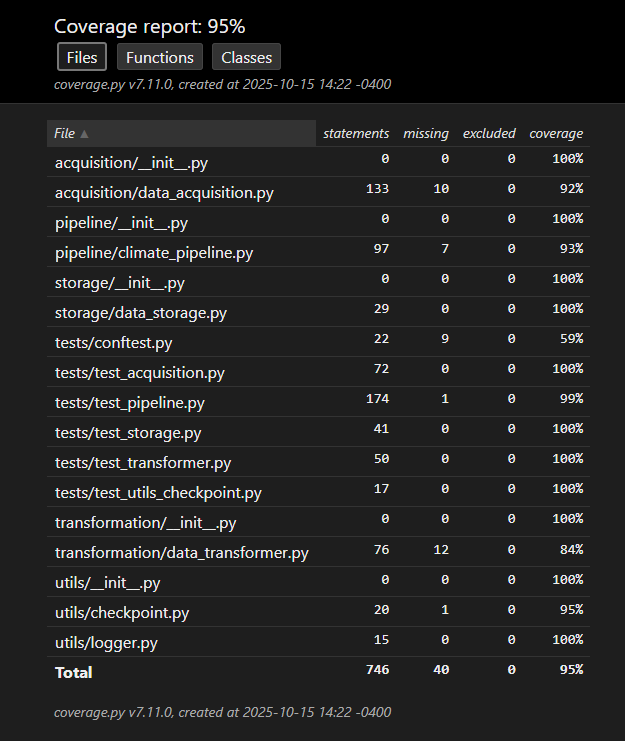

# Climate Data Analysis Pipeline
This project prototypes a data engineering pipeline for acquiring, transforming, and storing climate datasets from NOAA’s Leaf Area Index (LAI) and Fraction of Absorbed Photosynthetically Active Radiation (FAPAR) Climate Data Record (CDR).

The pipeline is designed to support exploratory analysis of climate change impacts on vegetation health by automating the ingestion and filtering of large-scale satellite datasets into an analysis-ready format.

---
## Hypothesis

This project investigates the long-term relationship between vegetation health and climate variability in the Florida Everglades using the NOAA Climate Data Records (CDR) of Leaf Area Index (LAI) and Fraction of Absorbed Photosynthetically Active Radiation (FAPAR).

We hypothesize that over the 40-year period from 1985 to 2025, the Everglades exhibit a moderate upward trend in LAI—indicating gradual increases in vegetation density and canopy greenness—accompanied by a slight but consistent increase in FAPAR, suggesting improved photosynthetic efficiency and energy absorption by plant canopies. These changes are expected to correlate with warming temperatures and longer growing seasons driven by global climate change.

The intent of this study is to leverage automated, reproducible data engineering methods to transform NOAA’s satellite-derived CDRs into an analysis-ready dataset, enabling objective trend assessment and validation of climate–vegetation interactions within a sensitive subtropical ecosystem.

---
## Background
The NOAA LAI & FAPAR CDR combines satellite observations into a long-term, consistent dataset of two key biophysical variables:

 - Leaf Area Index (LAI)
Tracks the one-sided green leaf area per unit of ground surface area. It is widely used to monitor vegetation growth, productivity, and canopy structure.

 - Fraction of Absorbed Photosynthetically Active Radiation (FAPAR)
Quantifies the solar radiation absorbed by plants in the PAR spectral region (400–700 nm). It is a core variable for photosynthesis modeling, carbon cycle studies, and drought/vegetation stress monitoring.

These variables provide essential inputs for:

 - Climate change impact assessments

 - Vegetation stress monitoring

 - Forecasting agricultural yields

 - Hydrology and ecosystem modeling

 - Natural resource management

 ## Project Goals
  - Automate data acquisition from NOAA’s public S3 bucket.

 - Filter datasets by geographic bounding box (e.g. Tampa Bay, Florida Everglades).

 - Transform NetCDF (.nc) files into Parquet format (optimized for big data analytics).

 - Store results in Azure Data Lake Storage (ADLS) as blobs for scalable analysis.

 - Implement checkpointing to skip already-processed files.
 
 - Parallelize downloads and transformations for faster runtime using Python’s ThreadPoolExecutor.

 - Add automated unit and integration testing with pytest and coverage reporting.

 - Prototype orchestration with Airflow, paving the way for scheduled ingestion of new data.

 - Log metrics on pipeline performance (files, rows, columns, runtime).

 - Enable distributed data processing with Apache Spark and Azure Databricks.

 ## Tech Stack
 - Python (pandas, xarray, netCDF4) — data parsing and transformation

 - Azure Blob Storage / Data Lake — cloud storage for processed datasets

 - Apache Airflow — workflow orchestration (prototype DAG provided)

 - Apache Spark (PySpark) - for task and query execution

 - Azure DataBricks - Spark cluster environment for queries and analytics

 - Logging — pipeline logs (pipeline.log)
 
 - Pytest + Coverage — automated testing for all pipeline modules

 - Git — version control

 - NOAA S3 Bucket — raw data source (noaa-cdr-leaf-area-index-fapar-pds.s3.amazonaws.com)

 ## Project Structure
 ```bash
 ClimateDataAnalysis/
├── acquisition/           # Data acquisition from NOAA S3
│   └── data_acquisition.py
├── transformation/        # Filtering & transformation of NetCDF to Parquet
│   └── data_transformer.py
├── storage/               # Upload to Azure Data Lake Storage
│   └── data_storage.py
├── pipeline/              # Orchestrator with parallel execution
│   └── climate_pipeline.py
├── utils/                 # Logging & checkpoint helpers
│   ├── logger.py
│   └── checkpoint.py
├── tests/                 # Unit + integration tests (pytest)
│   ├── conftest.py
│   ├── test_acquisition.py
│   ├── test_transformer.py
│   ├── test_storage.py
│   ├── test_pipeline.py
│   └── test_utils_checkpoint.py
├── notebooks/             # Databricks notebooks for analysis and visualization
│   ├── 01_explore_lai_fapar.ipynb
│   ├── 02_yearly_trends.sql
│   ├── 03_lai_faipar_analysis_dashboard.ipynb
│   └── 04_lai_faipar_drilldown.ipynb
├── dags/                  # Example Airflow DAG
│   └── climate_pipeline_daily_dag.py
├── ClimateRecords/        # Local download cache (ignored in Git)
├── requirements.txt       # Python dependencies
├── .gitignore             # Ignore data, logs, envs
└── README.md
 ```

 ## Setup
*This Project runs from within a WSL2 instance with an installation of Python 3.12 for Databricks VSCode integration.*
 1. Start your virtual environment
 ```bash
python -m venv venv
 ```
 2. Install dependencies
 ```bash
 pip install -r requirements.txt
 ```
 2. Configure Azure storage (via .env file)
 ```bash
AZURE_STORAGE_ACCOUNT=<your-account-name>
AZURE_STORAGE_KEY=<your-storage-key>
AZURE_BLOB_CONTAINER=<your-blob-container>
 ```
 3. Set Python path to run Spark job
 ``` bash
 PYTHONPATH=$PWD
 ```
 4. Run the pipeline
 ```bash
 spark-submit ./pipeline/climate_pipeline.py
 ```
By default, it selects the first N days of each year (configurable) and caps the total downloaded size (e.g. ~3 GB).

5. Check results in Azure Data Lake (example with Azure CLI)
```bash
az storage fs file list -f climate-data-analysis --account-name <your-account> --output table
```
## Testing & Coverage
All modules include unit and integration tests.

Run the full test suite:
```bash
pytest -q --cov=. --cov-report=term-missing
```
Generate an HTML coverage report:
```bash
pytest --cov=. --cov-report=html
wslview htmlcov/index.html  # view in Windows browser
```

Generate an HTML test report: 
```bash
pytest --html=test-report.html --self-contained-html
wslview test-report.html
```

---
# Conclusion
Over the 40-year observation window (1985–2025), analysis of the NOAA LAI and FAPAR Climate Data Records for the Florida Everglades reveals a moderate increase in LAI and a slight upward trend in FAPAR during the first month of each year. These results suggest a gradual intensification of vegetation cover and a small improvement in the fraction of absorbed solar radiation available for photosynthesis.

Such findings are consistent with the global patterns reported in Xiao et al. (2024) in Earth System Science Data (DOI: 10.5194/essd-16-15-2024
), which describe widespread increases in vegetation greenness and productivity linked to climate warming, elevated CO₂ concentrations, and changes in precipitation regimes.

While localized hydrological pressures and land-use changes continue to influence Everglades vegetation dynamics, the observed increases in LAI and FAPAR align with the broader evidence of climate-driven enhancement of photosynthetic activity in many subtropical wetlands. Continued monitoring through high-resolution satellite CDRs will be critical for assessing the resilience and long-term ecological trajectory of the Everglades under ongoing global warming.